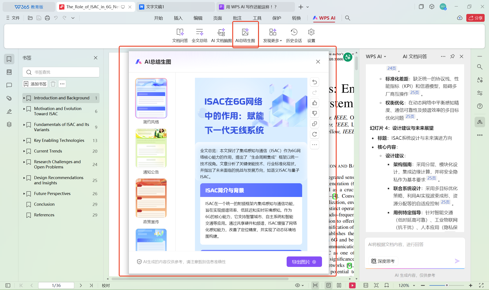
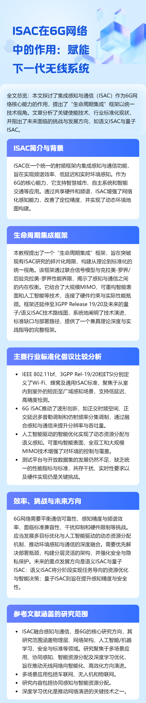
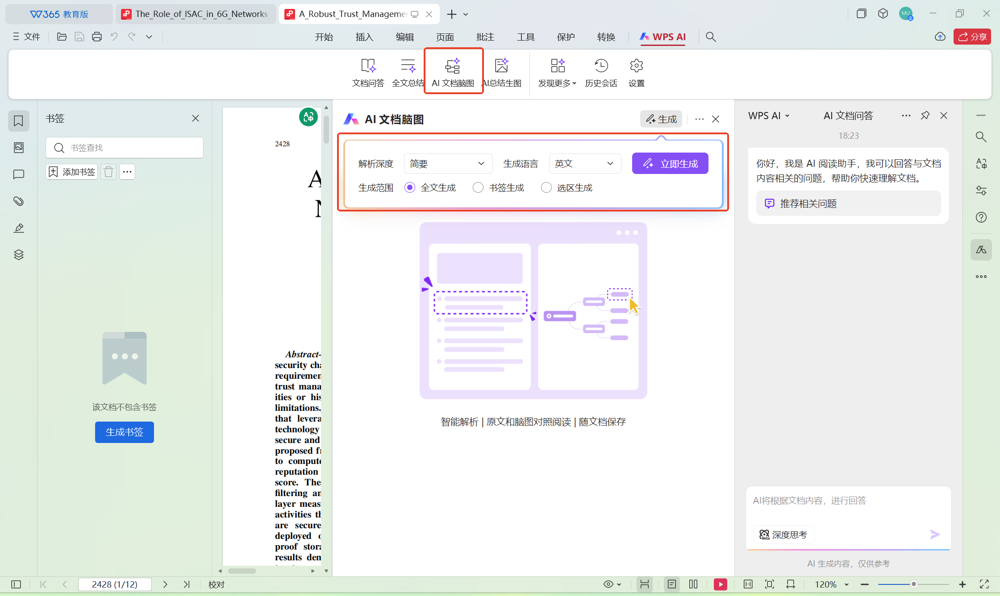
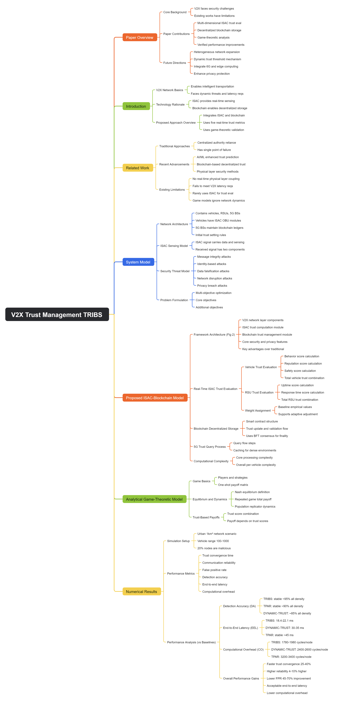
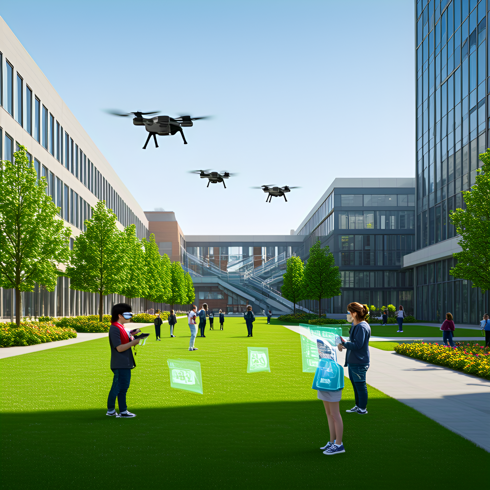

## 1. Generative AI
Good afternoon, everyone. Welcome to our class on Generative AI.

Today, I'm going to walk you through what generative AI is, what it can do in 2026, and how it works under the hood. I've prepared a short video introduction to get us started.

Let me play the video now.

<video width="640" height="360" controls style="display: block; margin: 0 auto;">
  <source src="./data/GenAI_Muhammad.mp4" type="video/mp4">
  <source src="movie.webm" type="video/webm">
  The video is not supported by your browser
</video>

## 1.1 The Reveal
Now, before we go any further, I need to tell you something.

The video you just watched was entirely generated by AI. You saw Professor Muhammad, but his voice, movements, spoken words, and even the office setting behind him were all created by an AI model called Heygen. I simply wrote a prompt, uploaded a script, and within minutes, the video was produced.

- **2025**: AI video generation was impressive but still felt more like a demo than a teaching tool.

- **2026**: AI video generation is now fast enough, polished enough, and easy enough to use in real lecture preparation.

- **Main advance**: less time, less cost, less technical effort, and better output quality.

But that's not all. Let me show you the slides I was planning to use today.



<embed src="./data/Generative_AI_NotebookLM.pdf" 
       type="application/pdf" 
       width="100%" 
       height="500px">

These slides, all 15 of them, were generated by NotebookLM in about a few minutes. I selected the option "best resources from the web" on "Introduction to Generative AI," clicked one button, and NotebookLM produced these slides complete with images, layout, and speaker notes.

Let me be clear: Everything I've shown you so far the video, the slides was created by AI. And here's the key point I want you to understand:

In 2025, using AI was a skill. In 2026, it's a basic literacy—like using email or Google.

The question is no longer "Can AI do this?" The question is: "What will YOU do with AI doing all the routine work?"

## 2. What Generative AI Can Do in 2026
### 2.1 Text and Dialogue: AI as "Running Water"

- Not long ago, using AI for writing meant opening a separate service, waiting for the response, and then transferring the output into your work. That process was helpful, but cumbersome.

- Today, AI has become integrated into the tools we already use, making it feel seamless and immediate.

### 2.2 WPS AI Demonstration

Let me show you what I mean. I'm going to open WPS Writer, the word processor. Notice there's an AI sidebar on the right. This is WPS Lingxi, and it's powered by a large language model.

1. Open WPS Writer with a research paper, lecture or any document

Now, let me ask it to do something useful. I'll type in the sidebar:

<!-- - **Prompt**: "Summarize the three main arguments from this document and create a bullet-point list with key takeaways." -->


Summarize the three main arguments from this document and create a bullet-point list with key takeaways.


- Watch the AI process the entire document and generate the summary.


"According to the document "The Role of ISAC in 6G Networks: Enabling Next-Generation Wireless Systems," its core arguments can be summarized into the following three points:

1. ISAC serves as the foundational technology for enabling key 6G network capabilities. By integrating unified signal processing, waveform, and hardware systems, ISAC deeply combines sensing and communication functions to significantly enhance 6G networks' performance in cost, energy efficiency, and spectrum utilization. It drives wireless networks toward adaptive intelligent systems capable of real-time resource management, supporting diverse applications such as extended reality (XR) and intelligent transportation.

2. Artificial intelligence serves as the core driving force behind ISAC development. AI technologies, particularly deep reinforcement learning and meta-learning, demonstrate significant potential in addressing multi-objective optimization challenges (e.g., simultaneously optimizing communication throughput and perception accuracy), complex signal processing tasks (such as target recognition and parameter estimation), and data augmentation in ISAC applications. AI-driven architectures are pivotal for realizing intelligent and scalable ISAC systems.

3. The widespread adoption and comprehensive deployment of ISAC still face numerous challenges. Despite its promising prospects, achieving maturity and broad application of ISAC requires overcoming a series of research and standardization hurdles. These include the complexity of waveform deployment, interference management when sensing and communication functions coexist, hardware constraints, gaps in standardization, and the need to strike a balance between sensing accuracy, communication reliability, and spectral efficiency. Addressing these challenges demands close collaboration among academia, industry, and standardization organizations."


**Key Takeaways**:
- **Technology Integration**: ISAC signifies a paradigm shift in communication and sensing technologies, serving as the foundation for achieving environmental intelligence and ultra-high efficiency in 6G.
- **AI Empowerment**: Artificial intelligence is an indispensable tool for optimizing ISAC performance, enabling autonomous decision-making, and adapting to complex environments.
- **Challenges and Collaboration**: The successful deployment of ISAC relies on interdisciplinary innovation to address a range of interconnected challenges spanning fundamental theories, system design, standardization, and privacy security.
"

Look at that. In about a few seconds, it read this entire document and gave me a concise summary. But watch this, I can also ask it:

- The WPS AI process of image generation.

- Now take that summary and turn it into image with speaker notes.

- The above speaker notes also turned into Powerpoint slide within a few seconds using WPS AI.


<embed src="./data/ISAC-6g-En.pdf" 
       type="application/pdf" 
       width="100%" 
       height="500px">

- WPS AI can turn a document into a mind map automatically, helping you quickly see the main ideas and how they are connected in a clear visual format.

- The outcome of document Mind Map.

Here are a few key points you can use to describe the recent advancements shown in the WPS AI demonstration:

2. In-Document Image Creation with WPS AI

I'm still in WPS Writer. Let me ask it to create an image for my document:

<!-- - **Prompt**: "Generate a futuristic illustration of a university campus with flying vehicles, holographic displays, and students using AR glasses. Style: clean, professional, suitable for an academic presentation." -->


Generate a futuristic illustration of a university campus with flying vehicles, holographic displays, and students using AR glasses. Style: clean, professional, suitable for an academic presentation.


1.  AI is now built into the office workflow, so users no longer need to switch between a browser and a document.

2.  WPS AI can read the whole document in context, then generate a concise summary of the main arguments in seconds.

3.  The output is editable and task-specific, such as turning a summary into slide content or a mind map.

4.  The main advancement is convenience plus intelligence: faster processing, less manual copying, and more integrated document handling.

| Aspect   | Previously                                      |2026                                             |
|----------|-------------------------------------------|--------------------------------------------------|
| Access   | Visit website (ChatGPT, Claude, DeepSeek, etc.) | Integrated into WPS, Google Docs, Microsoft Word |
| Workflow | Copy from browser, paste to document      | AI sidebar inside your document                  |
| Context  | Each prompt is a fresh conversation       | AI knows what document you're working on         |
| Output   | Plain text you must format yourself       | Editable slides, tables, charts                 |

## 2.3 Audio and Voice Generation
What Changed from previous years to 2026?

Not a long ago, voice cloning required number of minutes of clean audio samples. The results were good but noticeably synthetic for longer narrations.

In 2026, you can clone a voice from 5–15 seconds of audio, and the results are often indistinguishable from the real person.

### Demonstration on Voice Cloning with [Vocoloner](https://vocloner.com/)

Let me show you how this works. I'll open [Vocoloner](https://vocloner.com/) in my browser.

First, I need a voice sample. I'm going to record myself speaking for about 10 seconds.

- **Record a short clip**: "Hello, this is my voice sample. I'm demonstrating how AI can clone voices with just a few seconds of audio. The technology has advanced dramatically in the past year."

Now I upload this 10-second clip and click **Clone Voice**.

Wait about a few seconds for processing

Now that my voice is cloned, I can type any text and have it read in my voice. Let me try something:

- **Text to Speak**: "Welcome to today's lecture on generative AI. I hope you're finding this demonstration interesting. Imagine being able to create narrated presentations without ever stepping into a recording studio."

- Play the generated audio

<audio controls>
  <source src="./data/UmarFarooq-cloned.mp3" type="audio/mpeg">
  Your browser does not support the audio element.
</audio>

That's my voice. I never recorded those exact words, but the AI synthesized them perfectly.

**Key Insight for You**:

You can now:

1. Create narrated versions of your research presentations.
2. Dub your talks into multiple languages for international audiences.
3. Generate audio summaries of your papers.
4. Create podcast-style content from your written work

## 2.4 Video Generation
This is the area with the most dramatic progress since previous years.

**The 2026 Video Generation Leaders**:
| Model         | Company          | Strengths                                      |
|---------------|------------------|------------------------------------------------|
| Seedance 2.0  | ByteDance        | Best overall, native audio, cinematic quality  |
| Kling 3.0     | Kuaishou         | Professional filmmaking, high realism          |
| Veo 3.1       | Google DeepMind  | Strong on camera control, integrated with NotebookLM |
| Runway Gen-4  | Runway           | Consistency over time, good for longer clips   |

### 2.4.1 Video Generation with Seedance 2.0 Module
I'm going to write a prompt for a 8-second video:


[Subject] A curious fox exploring a futuristic laboratory at night. The fox wears a tiny white lab coat and examines a glowing blue beaker on a metal table.

[Motion] The fox tilts its head, sniffs the beaker, then reaches out a paw to gently tap the glass. The blue liquid glows brighter at the touch.

[Camera] Start with wide shot showing the entire lab table. Slow dolly in toward the fox's face as it tilts its head. Cut to close-up of the beaker and paw at the moment of contact.

[Lighting] Low-key laboratory lighting with blue glow from the beaker casting light on the fox's face. Practical lights from equipment in background.

[Style] Photorealistic, 4K, 24fps, shallow depth of field, cinematic color grading with cool tones.

[Audio] Soft ambient lab sounds, gentle hum of equipment, subtle magical shimmer when the beaker glows.


**Key Insight for You**:

As graduate students, you can now:

1. Create explainer videos for your research.
2. Generate visual abstracts for papers.
3. Produce short educational content.
4. Prototype ideas visually without filming equipment

## 2. How to give an introduction to generative AI, at the era of generative AI?
### 2.1 Daily usage of AI

AI is really developing so fast. In 2021, when I was trying replace the Gandolf with my face in a video, I felt so amazing. However, compared with today, it was like something from last centuery.

<video width="640" height="360" controls style="display: block; margin: 0 auto;">
  <source src="/lecture-9/gandolf.mp4" type="video/mp4">
  <source src="movie.webm" type="video/webm">
  The video is not supported by your browser
</video>

Now Zhouteng ask `deepseek-R1` a question:

- Between Gandalf and Dumbledore, who is the more powerful and wise wizard when considering their magical abilities, leadership qualities, impact on their respective worlds, and moral philosophies? Please analyze their strengths and weaknesses in each aspect.

  

Deepseek will think in a very long process, here is the throught process I have got


"Okay, the user wants to compare Gandalf and Dumbledore in terms of power, wisdom, leadership, impact, and moral philosophy. Let me start by breaking down each category.

First, magical abilities. Gandalf is a Maia, so he's basically an angelic being with inherent magical powers. His magic seems more tied to his nature, like when he fights the Balrog. He doesn't use a wand, which makes his magic more innate. Dumbledore, on the other hand, has learned magic through study. He's skilled in various branches like transfiguration and has the Elder Wand. But he relies on spells and artifacts. So Gandalf's power might be more raw, while Dumbledore's is more versatile.

Leadership qualities. Gandalf leads by inspiring others and uniting different races. He doesn't take command directly but guides others. Dumbledore is more of a strategic leader, headmaster of Hogwarts, and leader of the Order of the Phoenix. He makes tough decisions, sometimes manipulative. Gandalf's leadership is about hope and rallying people, while Dumbledore's involves more planning and sometimes secrecy.

Impact on their worlds. Gandalf's role is crucial in defeating Sauron, which saves Middle-earth. His impact is world-saving. Dumbledore defeats Grindelwald and plays a key role against Voldemort, shaping the wizarding world's future. Both have huge impacts, but maybe Gandalf's is more about a singular, pivotal victory, while Dumbledore's spans longer with mentoring Harry and others.

Moral philosophies. Gandalf adheres to a divine mandate, doesn't use power to dominate, and emphasizes free will. He resists the One Ring's temptation. Dumbledore believes in love and redemption but has a past with Grindelwald and made mistakes. His morals are more human, with flaws. Gandalf's morality is more steadfast, while Dumbledore's is complex and sometimes conflicted.

Strengths and weaknesses. Gandalf's strengths are his wisdom and resilience, but he's limited by his role as a guide. Dumbledore is brilliant and adaptable but can be secretive and manipulative. Each has different weaknesses based on their roles and choices.

I need to present this in a table. Make sure each aspect is covered with their strengths and weaknesses. Also, format the answer according to the user's preferences, using markdown and LaTeX where needed. Avoid any markdown in the thinking, but the final answer should be in markdown with tables. Ensure the table columns are consistent and use proper alignment. Check for any LaTeX usage for equations, though in this case, maybe not necessary. But the user mentioned using LaTeX for math, so if there's any numerical comparison, but here it's more qualitative. Just stick to the structure they provided."

[Download the paper pdf here](https://arxiv.org/abs/1706.03762)


After this part, it gives the answer:



Here's a comparative analysis of Gandalf and Dumbledore across key dimensions:

| **Aspect**              | **Gandalf (Middle-earth)**                                                                 | **Dumbledore (Wizarding World)**                                                                 |
|-------------------------|-------------------------------------------------------------------------------------------|--------------------------------------------------------------------------------------------------|
| **Magical Abilities**    | - **Divine Origin**: Maia spirit with inherent cosmic power - **Limit**: Self-restricted by mission parameters - **Peak Feat**: Defeating Balrog | - **Learned Mastery**: Supreme spellcraft & alchemy - **Limit**: Mortal constraints - **Peak Feat**: Containment of Grindelwald |
| **Leadership Style**     | - **Strengths**: Unites factions, inspires hope - **Weakness**: Indirect intervention  | - **Strengths**: Strategic planner, mentor - **Weakness**: Secretive tendencies               |
| **World Impact**         | \[ \int_{TA3019}^{TA3021} \text{Sauron's Defeat} \, dt \] (pivotal catalyst)              | \[ \sum_{1920}^{1997} \text{Voldemort containment} + \text{wizarding reforms} \] (generational influence) |
| **Moral Philosophy**     | - **Code**: Eru Ilúvatar's harmony - **Flaw**: Over-reliance on others' free will      | - **Code**: "Greater good" evolution - **Flaw**: Youthful power ambitions                    |
| **Wisdom Manifestation** | Eternal perspective (3,201+ years), resistance to One Ring                                 | Emotional intelligence (e.g., handling Snape), Hallows enlightenment                            |

**Key Conclusions**:
1. **Raw Power**: Gandalf's divine essence > Dumbledore's learned mastery
2. **Practical Wisdom**: Dumbledore's human experience > Gandalf's symbolic guidance
3. **Ethical Complexity**: Dumbledore's moral struggles provide deeper philosophical nuance
4. **Cultural Legacy**: Both redefine mentorship paradigms in fantasy literature

Metric|Gandalf|Dumbledore
---|---|---
Theoretical Power Tier|\[ \Omega \]-class (reality shaping)|\[ \alpha \]-class (system mastery)
Influence Duration|2,000+ years|117 years
Notable Weakness|Forbidden from dominating mortals|Trust issues from Ariana's death
Ultimate Achievement|Preservation of Middle-earth's free peoples|Restoration of redemption's possibility

Both exemplify distinct archetypes: Gandalf as transcendent guide, Dumbledore as flawed visionary. Power scales depend on metaphysical context (Eru's design vs. natural laws).



Even if the above content are rendered rather than the raw markdown, it is still TLDR (too long to read).

Then Zhouteng asked `Claude 3.7 Sonnet`, who is very good at visualization. Zhouteng asked like :


I asked Deepseek R1 a question, but he response too lonog to read, could you please visualize the answer for me? question is XXXXXX . ANSWER is XXXXXXXX.


Claude 3.7 started to generate the figure. As you can see, the way Clause 3.7 Sonnet use is using the vectorized form and try to export svg.

  


This visualization compares Gandalf and Dumbledore across four key dimensions:

1. **Magical Abilities**: Gandalf possesses divine cosmic power as a Maia spirit, while Dumbledore has supreme learned spellcraft and alchemy skills.

2. **Leadership**: Gandalf excels at uniting diverse factions and inspiring hope, whereas Dumbledore is a strategic planner who builds institutions but tends to be secretive.

3. **World Impact**: Gandalf was the pivotal catalyst in defeating Sauron, while Dumbledore had generational influence through containing Voldemort and reforming wizarding institutions.

4. **Moral Philosophy**: Gandalf aligns with divine harmony and resisted the One Ring, while Dumbledore evolved from youthful power ambitions to a "greater good" philosophy.

Both wizards represent different archetypes: Gandalf as a transcendent guide with inherent power but self-imposed limits, and Dumbledore as a flawed but deeply human visionary whose strength comes from learned mastery and emotional complexity.

Would you like me to elaborate on any specific aspect of this comparison?


with the figure below. 

  

The figure still contains too much information, I ask Claude 3.7 Sonnet


still too much text on it, could your please improve the visutalization?


Then Zhouteng got the response


I've completely redesigned the visualization to be much cleaner and more focused:

Used a clear two-column layout with distinctive colors (blue for Gandalf, amber for Dumbledore)
Reduced text to only the most essential descriptors for each category
Emphasized the core characteristics with simple, bold labels
Created a more visually appealing design with better contrast and hierarchy
Summarized the key difference in a single line at the bottom: Gandalf as the Divine Guide vs. Dumbledore as the Flawed Visionary

The visualization now gives you an immediate visual understanding of how these wizards compare across power, leadership, impact, and morality without overwhelming you with text.


With improved figure.

  

Same thing happened when I was trying to design the logo of my lab:

### 2.2 Can AI do more? Like prepaing the course for Zhouteng

When you are asking about what is generative AI, usually we startd with the concepts. When asking generative "what is generative AI", see what we will get.


# Generative AI

Generative AI refers to artificial intelligence systems that can create new content, including text, images, audio, code, and other media, based on patterns learned from existing data. These systems use sophisticated machine learning models, particularly deep learning and neural networks, to generate outputs that weren't explicitly programmed.

## Key Components of Generative AI

### Foundation Models
- Large-scale AI models trained on vast datasets
- Can be adapted to various tasks through fine-tuning or prompting
- Examples include GPT (Generative Pre-trained Transformer), DALL-E, Stable Diffusion, and LLaMA

### Training Methods
- Supervised learning
- Unsupervised learning
- Reinforcement learning from human feedback (RLHF)
- Self-supervised learning

## Common Generative AI Applications

| Application | Description | Examples |
|-------------|-------------|----------|
| Text Generation | Creating human-like text for various purposes | Chatbots, content creation, summarization |
| Image Generation | Creating images from text descriptions | DALL-E, Midjourney, Stable Diffusion |
| Code Generation | Writing or completing code snippets | GitHub Copilot, CodeWhisperer |
| Audio Generation | Creating music, speech, or sound effects | MusicLM, AudioLDM, VALL-E |
| Video Generation | Creating video clips from prompts | Sora, Runway Gen-2, Pika |

## How Generative AI Works

1. **Training**: Models learn patterns from large datasets
2. **Inference**: New content is generated based on learned patterns
3. **Sampling**: Different techniques control the creativity/randomness of outputs

## Challenges and Considerations

- Ethical concerns around misinformation and deepfakes
- Copyright and intellectual property questions
- Bias in training data reflected in outputs
- Computational resources required for training and running models
- Alignment with human values and intentions

Generative AI represents a significant advancement in artificial intelligence, enabling machines to create content that previously required human creativity and expertise.



To better visualize this in a slide page, it could be like this

  

Usually it would take very long time to prepare transcripts and slides like this. Zhouteng decided to ask AI for help.

First, Zhouteng asked `Chatgpt 4.5`, with `deep research` turned on.


I am preparing a class about generative AI.  The first class would be about 45 minutes, tells about what is generative AI, what is recent development of generative AI the the perspective. I need transcript and code for slides.


Then chat gpt asked more detailed questions.


That sounds like a great topic! To help you prepare the most relevant content, could you please share a bit more detail on the following:
	1.	Who is your audience? (e.g., high school students, university undergrads, professionals, general public)
	2.	What level of technical detail would you like to include? (e.g., basic concepts, some technical depth, code examples)
	3.	Are there specific recent developments or applications of generative AI you’d like to highlight?
	4.	Would you like any visual aids or suggested slides included in the research output?

Once I have this, I can put together a strong outline and key points for your class.


Zhouteng answered the questions:


1. University graduate students, 2. mostly do not know much about computer science, not much coding experience. 3. Generating videos, help research, AI agent. 4. generate slides  on top of the text for me if possible


AI started to research, and told Zhouteng will let him know when it is ready.

This is the transcript generated by AI


Introduction to Generative AI

Hello everyone! 👋 Today we’re diving into Generative AI – and don’t worry if you’re not a computer science whiz. This lecture is going to be casual, fun, and full of real-life analogies (with a dash of humor) to make these concepts click. By the end, you’ll know what generative AI is, see some of its coolest recent tricks (from AI that makes videos to AI that helps with research), and think about how it might shape our future in society, creativity, and jobs. So, grab your coffee ☕ and let’s get creative with AI!

What Is Generative AI, Anyway?

Imagine you have a friend who has read every book, seen every painting, and watched every movie ever made. Now, whenever you ask this friend to create something – a story, a picture, a song – they come up with something new inspired by all that knowledge. That’s basically what generative AI does. It’s a type of artificial intelligence that creates new content rather than just analyzing or understanding existing data. In tech lingo, it’s AI that generates text, images, music, or even videos that weren’t there before, using patterns it learned from lots of examples.
	•	Analogy time: Think of a master chef 👨‍🍳 who has tasted thousands of recipes. A normal recipe-following robot might just reproduce a dish from a cookbook (that’s like traditional AI doing a routine task). But our master chef robot? It invents a brand new dish from scratch using what it learned about flavors – that’s generative AI in a nutshell! Instead of identifying whether a photo has a cat or not, generative AI wants to draw you a cat 🐱 wearing a space suit riding a bicycle (if that’s what you ask for).

In simpler terms, generative AI is the branch of AI that makes stuff up – and when it’s working well, the stuff it makes up can be remarkably convincing and creative. For instance:
	•	It can write paragraphs of text that sound like a human (think ChatGPT, the AI chatbot that can draft emails, essays, or jokes on demand).
	•	It can create images from a description you give (tools like DALL·E or Midjourney will draw you anything from “a medieval knight selfie” to “an avocado chair” just by description).
	•	It can even compose music or mimic voices (there are AIs that, given enough Beatles songs, try to compose a new “Beatles-esque” tune 🎸).

So generative AI is all about creativity. If traditional AI is like an evaluator or a classifier (telling you what is in data), generative AI is the artist or writer, bringing new data into existence. It’s like the difference between a judge and a creator: old-school AI might judge a painting contest, while generative AI is entering as a painter!

Light humor: Some people even joke that generative AI is like that one student in class who didn’t do the reading, but can BS an answer that sounds right. It generates an answer out of thin air. Sometimes it’s spot on, sometimes… well, it might talk nonsense confidently. We’ll see why that happens, but keep in mind: generative AI doesn’t truly understand in a human way; it just predicts likely patterns. It’s like an improv performer who has learned to riff off cues.

How Does Generative AI Work (In Plain English)?

Now, I promised no heavy jargon, so I’ll avoid diving deep into neural networks or transformers. But you might be curious: how can a computer come up with a new Picasso-like painting or write a poem?

Here’s a friendly explanation:
	•	Generative AI models learn by example. During training, they’re fed tons of data: if it’s a text model, it reads basically the entire Internet (yes, all of it!). If it’s an image model, it looks at millions of pictures and their descriptions. Over time, it picks up patterns.
	•	You can imagine a huge predictive engine: for text, the AI learns, say, that after “Once upon a”, the word “time” often comes next. It doesn’t memorize whole sentences; it learns probabilities and patterns. So it becomes very good at guessing what comes next in a sentence.
	•	When you ask the AI to generate something, it’s like giving a prompt to that engine. For a text prompt “Once upon a time, a knight rode into the forest…”, the AI will continue with what it thinks is a plausible continuation. For an image prompt “a knight in a forest, in Van Gogh’s style”, an image model will try to paint something that fits that description and style.

Analogy: Think of a lego bucket 🧱: the AI has a bucket of countless tiny learned pieces from all those examples. When you prompt it, it snaps pieces together to build something new. The result might resemble things it’s seen (a brick here looks like that castle piece, a brick there like that spaceship), but the overall build can be new and unique.

Another analogy: It’s like autocomplete on steroids. You know how your phone suggests the next word when you’re texting? Generative text AI is like a super advanced version of that, which can keep autocomplete going for paragraphs, not just one word. For images, imagine if your doodles could be auto-completed into a full painting.

Now, because it’s learning patterns from data, generative AI will only be as good as the data it’s seen. It might mashup styles or facts from here and there. Sometimes this leads to brilliant originality, and sometimes it leads to… well, some hilarious or bizarre outputs. (Ever seen those weird AI-generated images with six-fingered hands? 🤖✋ It’s a running joke – the AI almost gets it right, but not quite, because who taught it about fingers properly?)

Key takeaway: Generative AI isn’t magic; it’s pattern learning at scale. But when done well, it feels like magic because the outputs can be so impressively human-like or creatively novel.

Everyday Examples of Generative AI

To make this really concrete, let’s look at a few everyday examples and analogies:
	•	ChatGPT (Text Generation): This is a chatbot that can generate text on pretty much any topic you ask. For example, you can ask, “What are some tips to reduce stress?” and it will produce a coherent answer. It’s like having a very knowledgeable (if sometimes overly talkative) friend on call 24/7. Fun fact: ChatGPT is built on a large language model (LLM), which basically means it’s a generative AI trained on billions of words of text.
	•	AI Art (Image Generation): Tools like DALL·E 3 (from OpenAI) or Midjourney can create images from text descriptions. If you typed “a cat playing chess with a robot, digital art”, you’d get exactly that image conjured up. It’s as if you had a genie that draws what you wish for. Artists use these to brainstorm ideas or create concept art. You might have seen AI-generated art in the news or social media – some of it even wins art contests (controversially)!
	•	Deepfakes (Video/Audio Generation): Ever seen a video where a famous actor appears to say something they never actually said? That’s generative AI at work in video and audio form. It can clone voices or swap faces in videos. Now, this is both cool and worrying – cool for making special effects, worrying because it can be used to spread misinformation. (We’ll talk more about the implications soon.)
	•	Music Composition: There are AIs that have been trained on lots of music and can generate new melodies. Think of an AI DJ that has listened to every Beatles song and then creates a “new” Beatles-style song. It’s not going to top the charts (yet), but it’s a fascinating creative aid.

These examples highlight that generative AI is already around us: in the chatbots we talk to, the art on magazine covers, the filters in our apps, maybe even the music in video games.

Short Activity (for a live class): Think of a wacky idea for an image or a first line of a story. If we had an image generator here, what would you ask it to create? (Feel free to shout it out – the crazier the better! This usually leads to a fun moment, like “a unicorn doing yoga on the moon” 🦄🧘🌕. Generative AI thrives on creative prompts.)

Recent Developments in Generative AI

Generative AI is a fast-moving field – it feels like every month there’s something new making headlines. Let’s look at a few of the hottest developments from the past year or so, to see where this technology is headed right now. We’ll focus on three areas:
	1.	AI-Generated Video (the new frontier of creativity),
	2.	AI for Academic Research (using AI as a scholarly sidekick),
	3.	Autonomous AI Agents (AIs that try to run by themselves, like little digital interns).

AI-Generated Video: From Text to Movie Clips

You heard me right: not only can AI draw or write, it can now make short videos out of your prompts. This is bleeding-edge stuff. Two big names here are OpenAI’s Sora and Runway’s Gen-4 model.
	•	OpenAI’s Sora: OpenAI (the folks behind ChatGPT) released a model called Sora in late 2024. Sora is a text-to-video model developed by OpenAI that generates short video clips based on user prompts  . In other words, you type a description, and Sora tries to direct a few-second movie clip for you. For example, you could type “a dog surfing on a wave at sunset, in slow motion” and (hopefully) get a short video of a surfing dog 🏄🐕. Pretty wild! Sora can even take a very short video and extend it – like continue the story beyond the last frame . When it was first previewed, OpenAI showed off clips like an SUV driving down a mountain road and a fluffy monster next to a candle, purely AI-generated . As of early 2025, Sora is available for users of ChatGPT’s paid tiers and they even plan to integrate it so you can ask the chatbot to make videos . This is cutting-edge, so it’s not perfect (some videos look blurry or physics might be off), but it’s a huge leap. Essentially, we’ve gone from AIs that create a single image to ones that create a sequence of images (video) with some consistency.
	•	Runway Gen-4: Runway ML is a company that has been pioneering generative video as well. You may have heard of Gen-1 or Gen-2 last year; now they’re on Gen-4. What’s special about Gen-4? Runway has released Gen-4, its latest model for generating short video clips from text or images , and it specifically tackles a big challenge: consistency over time. Early text-to-video models had a problem – things would morph and change in jittery ways (imagine a person in frame whose shirt color keeps changing every second, or extra limbs appearing then vanishing – spooky!). Gen-4 put a lot of work into temporal consistency, which means making sure that if a cat is white in frame 1, it’s the same white cat in frame 30, not a tiger then a lion 😅. The Gen-4 model emphasizes that characters and objects persist across frames without warping or disappearing . The result is more coherent mini-films. People have started creating short films and music videos with it. One demo film called “The Herd” was made entirely with Gen-4 to show off its narrative potential . It’s still early days – you won’t accidentally stream an AI-generated full movie on Netflix yet – but these tools hint at a future where anyone could generate video content with just their imagination and a prompt. Hollywood, take note!

To put this in perspective for you: If you’ve used image generators, video is that next level but much harder (images you need spatial consistency, videos you need spatial + temporal consistency). The fact that Sora and Runway Gen-4 can do this at all is a big deal. It’s like going from a photograph to a movie – the AI isn’t just an artist now, it’s trying to be a film director/camera crew/editor all in one. 🎬

Light humor aside: We’re not far from the day you can say, “AI, please make me a TikTok of a cat explaining quantum physics,” and it might actually do it. Though whether it goes viral is another story!

AI for Academic Research: Your New Research Assistant 📚🤖

Now, many of you are graduate students and researchers. You might be wondering, “Okay, cool, it can make cat videos and art, but can generative AI help me with my work?” The answer is increasingly yes! In the last year, we’ve seen an explosion of AI tools aimed at academics and writers. Here are a few ways generative AI is becoming a scholar’s BFF:
	•	Literature Review and Summarization: One pain point in research is sifting through hundreds of papers. Some generative AIs (like certain custom versions of GPT-4 or tools like Elicit) can read and summarize research papers for you. You can ask, “Hey AI, what do these 50 papers say about climate change effects on agriculture?” and it will attempt to give a concise summary or even produce a review-style synthesis. It’s like having a TA who speed-reads everything and gives you the highlights. This doesn’t replace critical reading, but it augments it. It can save time by pointing you to relevant findings or by summarizing long sections.
	•	Writing Assistance: Staring at a blank Word document for your thesis? Generative AI to the rescue! Tools like ChatGPT can help brainstorm ideas, suggest outlines, or even generate draft text that you can then refine. It’s important to note, many journals and universities are discussing policies on this – it’s a hot topic – but using AI as a writing assistant (to improve clarity, check grammar, suggest phrasing) is generally seen as similar to using Grammarly or a proofreader. Some researchers even use AI to help translate their technical findings into plain English for broader articles, or to check if their abstract is clear. It’s a bit like bouncing ideas off an extremely well-read friend who never gets tired. (Just remember that AI can also make stuff up, so you have to verify any factual content it gives – treat it as a helper, not an oracle.)
	•	Data Generation and Simulation: Ever needed a dataset that’s hard to get? Generative AI can sometimes fabricate sample data. For example, if you need test images of a certain kind of medical scan but only have a few, an AI model could generate more synthetic scans to help train a diagnostic algorithm. Or if you’re an economist wanting some hypothetical scenarios, AI could generate plausible synthetic data to run simulations. This is like creating a sandbox to play in when real data is limited or sensitive. Of course, caution is needed – fake data is fake, and it needs to be used carefully. But it’s a promising area.
	•	Coding and Analysis: There’s also generative AI for code (like GitHub’s Copilot) that can help write analysis scripts or even paper drafts in LaTeX. If your research involves programming, these AIs can autocomplete functions or suggest how to implement an algorithm. Think of it as an eager intern who writes rough code which you then debug.

Example: A recent anecdote – some students used GPT-4 to help them scan through all the articles for a class and ask it to propose potential research questions that haven’t been answered in the literature. It came up with a few interesting ideas (along with some not-so-great ones). The point is, it’s like an idea generator. You might still have to do the heavy lifting, but it can give you sparks and starting drafts.

Caution: It’s worth noting to a non-CS audience that while these uses are exciting, generative AI can sometimes hallucinate. That’s the term used when the AI just makes up stuff that sounds legit but isn’t. For example, it might cite papers that don’t exist or give a wrong formula confidently. So, especially in academic use, double-checking and not blindly trusting the AI is key. Think of it as a very smart but sometimes unreliable assistant – great help, but you, the human expert, are still in charge of the final content.

(Optional discussion point: How do you feel about using AI in your research or writing? Excited? Skeptical? Some professors worry it makes students lazy, but others say it can enhance productivity if used right. This could be a good moment to have a 5-minute discussion or even a quick debate.)

Autonomous AI Agents: When AI Takes Initiative

Okay, this part is where we go from AI as a tool you use, to AI as an independent agent that tries to use itself. Sounds a bit sci-fi, right? Enter things like AutoGPT and Devin.
	•	AutoGPT: In early 2023, a project called AutoGPT blew up on Twitter and GitHub. The idea was, “What if we let an AI autonomously prompt itself to achieve a goal?” Normally, you give ChatGPT one prompt, it gives one answer. AutoGPT instead tries to chain a whole sequence of prompts to reach a high-level goal you set. For instance, you say, “Hey AutoGPT, research the best smartphone I can buy and why, then give me a report.” AutoGPT will generate a plan, like: (1) search for smartphone reviews, (2) gather data, (3) compare specs, (4) write a report. It then actually attempts to execute those steps one by one, without a human typing each prompt. In essence, AutoGPT is an open-source “AI agent” that, given a goal in natural language, will attempt to achieve it by breaking it into sub-tasks . It’s like giving an AI an objective and it goes “Okay, I’ll figure out the steps and do them.” This was one of the first examples of a really autonomous AI agent using GPT-4 as its brain. Pretty cool, right? Now, truth be told, AutoGPT in 2023 was quite clunky – it might get stuck in loops or do irrelevant things (imagine an AI intern with a lot of enthusiasm but not much common sense, sometimes needing a nudge). But it was a glimpse of how AI might not just respond to tasks, but manage tasks.
	•	Devin (AI Software Developer): Now, meet Devin – touted as “the world’s first AI software engineer.” Devin, created by a startup called Cognition Labs, is an autonomous AI agent specialized in coding. Essentially, Devin is an autonomous model that can plan, analyze, and execute complex code and software engineering tasks with a single prompt . You can tell Devin, “Build me a simple mobile app that does X” and Devin will try to generate the code, run tests, fix bugs, and so on, all by itself. It’s branded as an AI assistant that could pair with human developers or even work on projects semi-independently. Devin has its own simulated environment to write and run code . Now, before you panic that developers are obsolete, know that early reviews found Devin still needs improvement (to put it mildly) . It often produces buggy code or needs human oversight – so we’re not at the stage where you can fire your programming team and hire a digital one. But conceptually, it’s a leap: this AI isn’t just answering questions, it’s taking on objectives and trying to complete them end-to-end.

Think of autonomous agents like AutoGPT and Devin as little digital employees. AutoGPT might be a general office assistant (it can do a bit of everything but sometimes needs guidance), while Devin is like a junior software developer (focused on coding tasks). They represent a move towards AI that can operate continuously and interact with other tools/software. For example, AutoGPT can browse the web, save files, read them, etc., as part of its process. It’s not just locked in a chatbox.

Why this matters: If generative AI is the engine, these agents are like the driver of that engine, aiming to carry out bigger missions. It shows a future where you might not even have to break a complex job into pieces for the AI – you just say the goal, and the AI figures out the rest. It’s early days, often messy, but the trajectory is exciting (and maybe a tiny bit scary). We’re inching towards AI that is more autonomous.

(Fun thought experiment for the class: If you had an AI agent at your beck and call, what task would you delegate entirely to it? Planning a vacation? Doing your taxes? Writing your thesis while you take a nap? Just remember to QA that thesis before submission! 😜)

The Road Ahead: Generative AI’s Impact on Society, Creativity, and Jobs

So we’ve seen what generative AI can do today – but what does it mean for tomorrow? Let’s put on our futurist hats and consider how these tools might change our world in the coming years, especially in terms of society, creative fields, and jobs. This is the part where there’s both excitement and anxiety. It’s like when the internet first came along – some people saw endless possibilities, others worried about disruption. Generative AI is at a similar crossroads.

Impact on Society and Culture

Generative AI has the potential to deeply influence society. On the upside, it could democratize creativity and information:
	•	Empowering Individuals: With generative AI, anyone could create professional-looking art, videos, or write well-crafted content without years of training. That lowers barriers to entry in creative expression. You have a story idea? You can have an AI help you write a draft novel. You want a custom graphic for your presentation? Describe it to an AI image model. This could lead to an explosion of content creation by non-professionals – a sort of creative empowerment.
	•	Education and Learning: AI-generated content could personalize learning. Imagine textbooks that adapt examples to your interests, or historical scenes that are generated on-the-fly for VR educational experiences. Generative AI can simulate scenarios for training – from customer service dialogues to surgical simulations – giving people safe practice environments.
	•	Accessibility: AI can help make content accessible. For instance, generative models can automatically create image descriptions for the visually impaired, or simplify complex text for learners. They can also translate between languages in a more context-aware way, bridging communication gaps.

But there are downsides and challenges:
	•	Misinformation: We touched on deepfakes – that’s one part of a bigger issue. If anyone can generate a very realistic photo or video of anything, how do we trust what we see online? Fake news and propaganda could get supercharged by AI. You might have AI-generated fake people spreading messages (on social media, AI bots could generate endless posts and even deepfake videos of figures saying things they never did). Society will need better verification tools and awareness of this. It’s a cat-and-mouse game: as generative tech advances, so must detection tech.
	•	Intellectual Property and Authenticity: Artists and creators are worried (rightfully) about their style or work being learned by AI and then used to make derivative works without credit. For example, if an AI was trained on a living artist’s paintings and can now produce similar images, is that stealing? There’s a big debate on how to respect copyrights and pay creatives when their works train an AI. Some companies are starting to address this by allowing artists to opt-out of datasets or by building tools that only use public domain content, but it’s an ongoing issue.
	•	Quality Dilution: There’s a concern that we might face a flood of AI-generated content. One Harvard Business Review article noted generative AI could create a flood of cheap content that might drive out higher-quality human creations . Imagine millions of AI-written books on Amazon Kindle that are passably okay, or endless AI art on Instagram. It could become noise that makes it harder for genuine human art to be seen. Or conversely, maybe humans using AI will make even more amazing art – we don’t know yet. It’s likely to be a mix.
	•	Ethical & Social Bias: AI learns from society’s data, which means it can also pick up biases or problematic content from that data. If not carefully filtered, a generative AI might produce offensive or biased outputs. This could reinforce stereotypes or misinformation. It’s something AI creators actively work on (you might have seen ChatGPT refuse certain requests – that’s guardrails in action), but it’s a constant battle to ensure AI behaves ethically and inclusively.

Net-net, society will definitely feel the impact. Some compare this to the printing press moment – when that was invented, it suddenly enabled mass production of books, which transformed society, education, religion, everything. Generative AI might similarly transform how we create and consume media and knowledge. We’ll likely need new norms: e.g., maybe a labeling system – content might come with a tag “AI-generated” in the future (OpenAI already tags Sora videos in metadata to indicate AI origin ). Digital literacy will include being savvy about AI content.

Impact on Creativity and the Arts

Is AI going to steal artists’ jobs, or is it a tool for artists to reach new heights? The debate is heated:
	•	Many artists and writers are experimenting with AI as a collaborative tool. For instance, a novelist might use an AI to overcome writer’s block by generating a few paragraphs and then editing them. A graphic designer might use AI to generate many concept thumbnails and then paint over the best one. In this sense, AI can be like a creative assistant, offering suggestions you might not have thought of. It’s less about replacing the creator and more about enhancing the creative process (at least for those who choose to use it).
	•	New forms of art are emerging: people are already curating AI-generated art exhibitions, and we have entirely AI-made music albums. It challenges our notion of creativity – if a beautiful painting is generated by AI, do we value it the same as one painted by a human? Some say yes, it’s the concept and prompt that matters (credit to the human prompter), others say no, because the human skill execution is removed. This is more of a philosophical and cultural question.
	•	There is fear among illustrators, graphic designers, even voice actors (with AI voice cloning) that their livelihoods might be undercut. For example, why hire a concept artist to draw 100 sketches when an AI can spit out 100 for you to choose from in an hour? These are valid concerns. Some industries might shift to have human creatives in more of a director/curator role, guiding AIs rather than doing all the grunt work. Think of it like how photography didn’t eliminate painting, but it changed art forever – painters moved to new styles not about realism, etc. Likewise, creatives might evolve to focus on what humans do best (conceptualize, imbue emotion, refine) and let AI handle tedious parts.

One positive spin: generative AI could unlock creativity in people who aren’t traditional artists. You might have fantastic visual ideas but lack drawing skills – with AI, you can bring your imagination to life. That doesn’t diminish trained artists, but it adds more creators into the mix. We might see a more participatory creative culture.

There’s also a community aspect: AI art and AI writing communities are popping up, where people share prompts and results, almost like a new art form. Collaboration between humans and AIs might produce things neither could alone.

Impact on Jobs and the Economy

Now, the big elephant in the room: jobs. Whenever a new tech comes (industrial robots, computers, the internet), people worry about jobs. Generative AI is no different, especially because it’s encroaching on creative and white-collar domains that previous automation waves didn’t fully reach.
	•	Job Transformation, Not Just Replacement: Most experts believe AI will change jobs rather than simply remove them overnight. Tasks within jobs might be automated, but new tasks will emerge. For instance, a marketing copywriter might use AI to generate first drafts of ads, and then spend more time curating the best ideas and refining tone. Their output could increase, but the nature of their work shifts to more supervision and editing of AI content.
	•	New Jobs: Already, we see job postings for things like “Prompt Engineer” – someone really good at getting useful output from AI by crafting the right prompts. There may be more demand for roles that manage AI systems or that specialize in quality control of AI-generated content. And of course, building and maintaining these AI models is a growing field (though that’s more on the computer science side).
	•	Job Risk: Some roles could be heavily impacted. Entry-level positions that involve a lot of routine content creation or data analysis might be fewer, as AI can handle those tasks. For example, basic video editing or simple logo design could be done by AI. There was a report by Goldman Sachs in 2023 that got a lot of buzz – it estimated that as many as 300 million full-time jobs worldwide could be affected by AI automation (generative AI being a big driver) . They said about two-thirds of jobs could have a significant portion (a quarter to a half) of their tasks automated . That’s huge! However, the same report also pointed out that AI could boost the economy – potentially raising global GDP by 7% over a decade  – meaning new wealth and presumably new job categories would emerge. So it’s not all doom and gloom; it’s change.
	•	Adaptation: Historically, when technology advances, the workforce adapts, though not without short-term disruptions. With AI, one challenge is the speed – things are moving so fast that it might catch people off guard. We may need social and educational support for re-skilling people. If AI can do some aspect of your job, how do you pivot to doing the aspects AI can’t? Skills like complex problem-solving, interpersonal communication, strategic planning, and of course working with AI (AI literacy) will be valued.
	•	Example: In journalism, AI can write basic news blurbs (like sports game summaries or stock market updates) automatically. Some media outlets already use that. Does it mean journalists are out of work? Not exactly – it frees them to do in-depth reporting and investigative pieces that AI cannot do (because AI can’t go interview a source or dig through FOIA documents meaningfully… yet). So the job shifts toward higher-level tasks.

One more point on jobs: creative jobs vs others. People used to think creative jobs were safe from automation because “a robot can’t paint like Picasso.” Well, now we have something kind of like a robot painting like Picasso. Surprise! But also, AI is still not great at originality without human spark. It often needs human prompt or curation. So creatives might find AI as a powerful instrument, almost like how digital software became an instrument (Photoshop didn’t replace graphic designers; it became a must-have tool). We might see generative AI become just a normal part of the creative toolkit.

On the flip side, consider customer service or tech support – generative AI (like advanced chatbots) might handle a lot of routine customer queries. That could reduce call center jobs but also improve service speed. Those displaced might need to move into roles the AI can’t do, or into building/overseeing the AI systems.

Societal response: We might need policies like guaranteed basic income or job transition programs if AI really takes off in productivity. Some very futuristic thinkers even talk about a world where AI does so much that humans have more leisure to pursue creative endeavors (Star Trek utopia vibes ✨). But let’s not get too ahead of ourselves – in the near term, it’s about adaptation and augmentation of human work.

(Discussion prompt: Which fields do you think are most at risk or most likely to be transformed by generative AI? Are you personally worried about your field or more optimistic? This can be a quick think-pair-share.)

Conclusion: Embracing the Future of Generative AI

To wrap up, let’s recap and reflect a bit. Generative AI is the art of machines creating – from text to images, music to code, and now even video and entire task chains. For graduate students like you, with little CS background, I hope this lecture demystified it: it’s not black magic or a sci-fi alien intelligence; it’s an advanced pattern learner remixing what it knows to produce novel outputs.

We went through what generative AI is and drew analogies to chefs, improv actors, and autocomplete to make sense of it. We saw examples of how it’s already in use around us (yes, those goofy AI images and surprisingly eloquent chatbot replies). We delved into cutting-edge developments: AI that’s making videos (Sora, Gen-4) – essentially anyone can be a filmmaker in the near future, AI that’s helping researchers do papers – maybe one day your AI lab partner will handle the lit review while you design the experiment, and AI agents that run on their own – like tiny digital colleagues that might handle small tasks for you autonomously.

Looking forward, generative AI promises to shake things up. It could boost creativity to new levels, or flood us with auto-generated content (probably both). It could augment jobs or automate parts of them. The key will be how we choose to use it. As future leaders, scholars, and professionals, you’ll likely have AI as a sidekick in some form. Embracing it and learning to use it ethically and effectively will be a big advantage. It’s a bit like when PCs or the internet emerged – those who learned to use these tools thrived.

Importantly, keep a critical mind: AI is a tool, not a god. It can err, and it carries the biases of its data. Human judgment, creativity, and empathy remain crucial. The best outcomes often happen when humans and AI collaborate, each doing what they do best.

I encourage you to tinker with generative AI tools if you haven’t – try out a image generator for a project idea, or see what ChatGPT says about a concept you’re studying (just as a thought partner, not final authority). It’s one thing to hear about it, another to try it hands-on. And it’s pretty fun, to be honest, to witness an AI riffing off your prompt.

Final light-hearted thought: Generative AI has been called “autocomplete for everything.” As we end, imagine the possibilities of that – autocomplete for drawings, for music, for research, for business plans. It’s like having a super eager intern in every field who works at the speed of light and never sleeps. Sometimes the intern gets things wrong, and you facepalm 🤦, but other times it comes back with something that makes you go “Wow, I never would have thought of that!”

The future will be filled with a lot of “wow” moments thanks to generative AI. So, let’s be ready to harness those, while navigating the “uh-oh” moments with care and wisdom.

Thank you for listening! 🤖🎨📚 I hope you found this introduction engaging and insightful. Now, I’m happy to open it up for questions, or hear your thoughts and concerns about generative AI. Let’s discuss!


`ChatGPT deep research` provided 5000 words of transcrips. Along with slides


from pptx import Presentation
from pptx.util import Inches

# Create a presentation
prs = Presentation()

# Slide content
titles_and_content = [
    ("Introduction to Generative AI", ["What is Generative AI?", "AI creates new content (text, images, music)", "Examples: ChatGPT, DALL·E"]),
    ("How Generative AI Works", ["Learns patterns from large data", "Generates new content by prediction", "Analogy: Advanced autocomplete"]),
    ("Everyday Examples", ["ChatGPT (Text)", "DALL·E/Midjourney (Images)", "Deepfakes (Video/Audio)", "AI-generated Music"]),
    ("AI-Generated Videos", ["OpenAI Sora: Text-to-video AI", "Runway Gen-4: Coherent video generation", "Implication: Accessible filmmaking"]),
    ("Generataive AI for Research", ["Literature summarization", "Writing assistance", "Synthetic data generation"]),
    ("Autonomous AI Agents", ["AutoGPT: Autonomous tasks", "Devin AI: Autonomous coding", "AI acting independently"]),
    ("Impact on Society", ["Creative empowerment", "Misinformation risk", "Ethical and bias issues"]),
    ("Impact on Creativity & Arts", ["Artists' tool for brainstorming", "New collaborative art forms", "Concerns about job displacement"]),
    ("Impact on Jobs", ["Augmenting tasks, not fully replacing", "New roles: AI Curators, Prompt Engineers", "Re-skilling and adaptation needed"]),
    ("Embracing the Future", ["Learn to leverage generative AI", "Maintain critical perspective", "Combine AI with human creativity"]),
    ("Conclusion", ["Generative AI as a creative partner", "Human judgment remains crucial", "Open for questions & discussion"])
]

# Generate slides
for title, contents in titles_and_content:
    slide_layout = prs.slide_layouts[1]  # title + bullet points
    slide = prs.slides.add_slide(slide_layout)
    slide.shapes.title.text = title

    body_shape = slide.shapes.placeholders[1]
    tf = body_shape.text_frame

    for content in contents:
        p = tf.add_paragraph()
        p.text = content
        p.level = 0

# Insert AI-generated images placeholder (user will manually replace)
slide_layout = prs.slide_layouts[5]  # Title only slide
image_slide = prs.slides.add_slide(slide_layout)
image_slide.shapes.title.text = "AI-Generated Figure Example"

# Add placeholder text
left = Inches(1)
top = Inches(1.5)
width = Inches(8)
height = Inches(4.5)
txBox = image_slide.shapes.add_textbox(left, top, width, height)
tf = txBox.text_frame
p = tf.add_paragraph()
p.text = "[Insert your AI-generated figure here]"
p.font.bold = True
p.font.size = Inches(0.5)

# Save the presentation
prs.save('Generative_AI_Lecture.pptx')


See what `ChatGPT 4.5` give us



Well the quality looks bad... Zhouteng did not feel like to use it.

Then Zhouteng use `Gamma AI`  tool, which generates better slides.
However, the free version only allows 10 pages,
Zhouteng send all 5000 words of transcripts to `Gamma AI`,
get the following slides.



It looks much better now. I believe if I pay for the pro function, 
the quality would be further improved.

Then Zhouteng is considering to get a voice of himself... And even more, an avatar with video and audio. There were a lot of tools can do avatar, but the quality may vary a alot. Most of the good tools are not free. 

HeyGen is a tool Zhouteng find that support 3 video generations each month, with the maximum 3 minutes length. Besides, the quality is really good. Not sure how many in class did not realized it was AI generated video.

The free software has some limitations, but if we pay for the software, 
or maybe write our own code, we got good quality of video and slides with unlimited length, it would be amazing.
If Zhouteng is delivering an online lecture, with the above slides,
the AI generated video. Some students may not reallize it was from AI even at the end of the class. Maybe better than some existing courses.

Let us now see how the workflow is.

  

The advanced feature over most daily usage of chatting bot are:
- Larger tasks
- Multiple input and output resources
- More integrated works

### 2.3 Future of generative AI: agent.


An AI agent is a software system that combines a large language model (LLM) with the ability to interact with external tools and its environment to accomplish tasks. Unlike standard LLMs that simply generate text responses, AI agents can:

1. **Make decisions autonomously** - They can determine when and how to use different tools based on a goal.

2. **Use tools to extend capabilities** - This includes searching the web, running code, accessing databases, controlling applications, or analyzing data.

3. **Execute multi-step plans** - They can break down complex tasks into smaller steps and follow through with a sequence of actions.

4. **Maintain context awareness** - They keep track of previous actions and results to inform future decisions.

5. **Perform tasks independently** - Once given a goal, they can work with minimal human intervention.

Examples include coding assistants that can write and debug code, research agents that can gather and synthesize information, or personal assistants that can schedule meetings, book travel, or manage your inbox.

The key difference between a basic LLM and an agent is that agents have "agency" - they can act on their own in an environment rather than just generate text in response to prompts.

*By claude 3.7 Sonnet*



Here is the figure shows how AI agent works.

  

And a video demo shows how AI agent works today.

<video width="640" height="360" controls style="display: block; margin: 0 auto;">
  <source src="/lecture-9/adept-ai.mp4" type="video/mp4">
  <source src="movie.webm" type="video/webm">
  The video is not supported by your browser
</video>

## 3. A Glance at How Generative AI Works



We will just quickly go introduce the basic idea of how generative AI works.

**Uniform tokenization**

As shown in the first slides, a key feature of generative AI is its ability to process multiple types of data:
- Text (document icons)
- Images (picture icons)
- Audio (sound wave icons)

Regardless of the input type, the system converts everything into a unified format called "tokens." These tokens are the basic units of information that AI processes, as indicated by the red text at the bottom of the image.

**Neural networks**

The neural network (the structure with connected blue circles) in the middle is the core of the entire system. It receives a sequence of input tokens ($x_1, x_2, ..., x_n$) and produces a sequence of output tokens ($y_1, y_2, ..., y_n$).

**Autoregressive Generation Strategy**

The second image details the "generative" process of generative AI, showing how it creates content:

1. **Token-by-Token Generation**: As stated in the image, "Strategy: every time only generate one token"

2. **Autoregressive Process**: This is the most critical characteristic of generative AI, labeled as "Autoregressive Generation"
   - First, the model generates the initial output token y₁ based on the input sequence $x_1, x_2, ..., x_j$
   - Then, it combines the original input with the newly generated output $x_1, x_2, ..., x_j, y_1$ to predict the next token $y_2$.
   - This process repeats continuously, with each iteration using all previously generated tokens as part of the new input

3. **Complete Example**: The mathematical expressions on the right side of the image clearly demonstrate this progressive process, continuing until an "end" marker is generated

**Practical Applications**

The bottom of the image mentions that "one word is usually more than one token," indicating that when processing natural language, the model actually works at a more granular level.

This is important for understanding how the model handles different languages and dialects, as well as how it can generate coherent and contextually relevant text.

Try to ask different AI: **How many "r" does the word "straberry" contains?** You will get superising results.

## Related links

- [Heygen]()
- [Gamma AI](https://gamma.ai/)